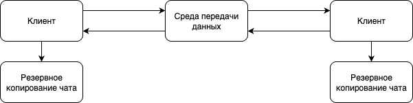

# Лучший мессенджер в мире

**Описание работы**: студентам предлагается спроектировать и реализовать простейший мессенджер, предоставляющий функции общения для двух отдельно взятых клиентов.

Высокоуровневая архитектура итогового приложения представлена на рисунке ниже.

## Задание на самостоятельную работу:
1. Реализовать две отдельные программы:
    - программу-клиент - должна быть способна принимать и отправлять сообщения другой копии программы-клиента
    - программу передачи данных - самостоятельно выбрать способ передачи данных (брокер сообщений или сервре-посредник)
2. Реализовать безопасную передачу сообщений (самостоятельно выбрать способ защиты передаваемых данных: ассиметричное шифрование и т.п.).
3. Реализовать функцию журналирования на уровне программы передачи данных.
4.  Реализовать функцию резервного копирования чата на клиентких программах.
5. Реализовать функцию защиты резервных копий от вскрытия и несанкционированного использования третьими лицами.